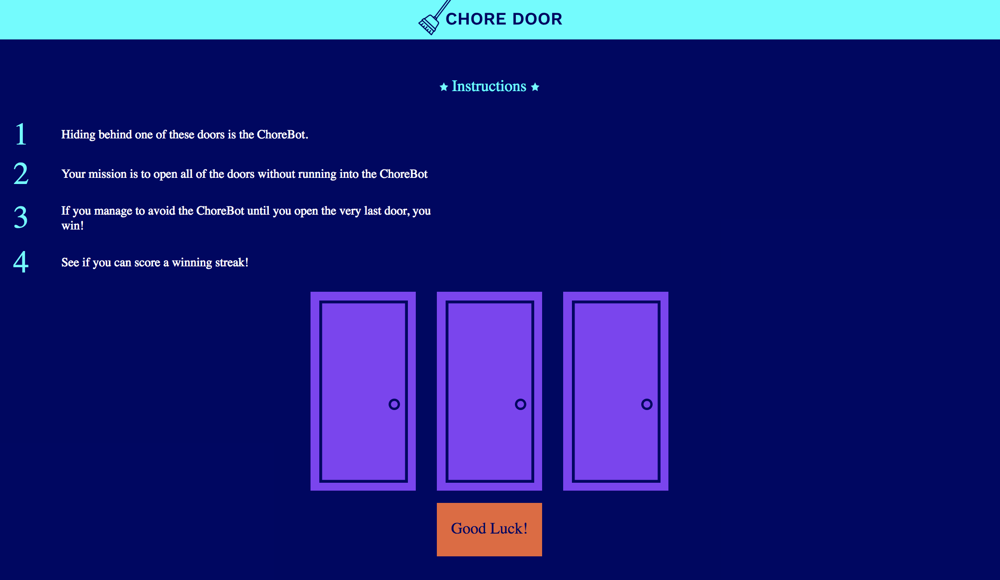
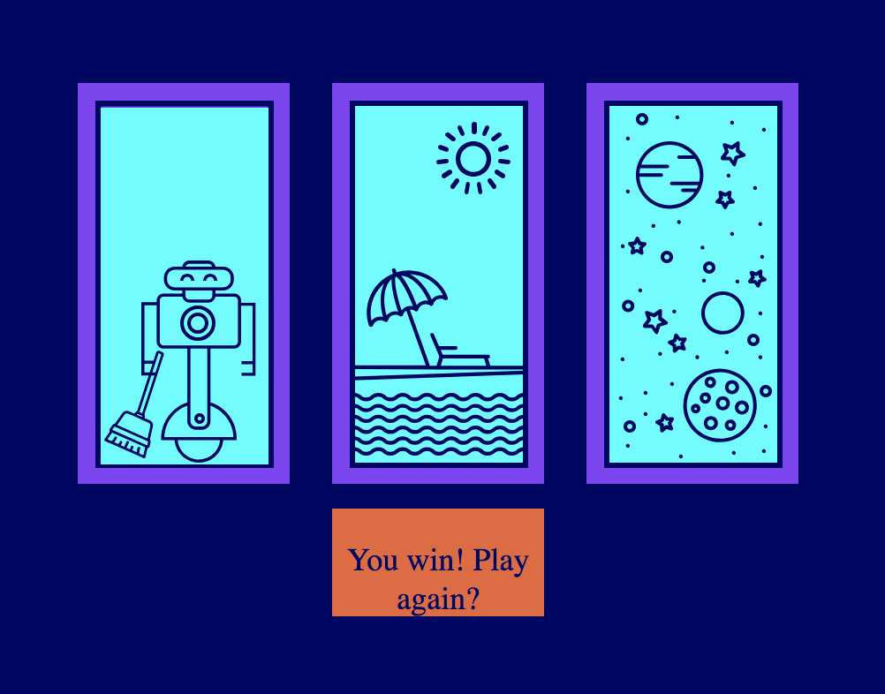

# Chore Door

This is a simple project to learn how to utilize vanilla JS.
This is a simiple game.  Here are the instructions:

- 1. Hiding behind one of these doors is the ChoreBot.
- 2. Your mission is to open all of the doors without running into the ChoreBot
- 3. If you manage to avoid the ChoreBot until you open the very last door, win!
- 4. See if you can score a winning streak!

### Running project

Simply clone the repo and open **index.html**

``` 
cd ~/Desktop/ &&
git clone https://github.com/amnotme/JSPractice.git &&
cd JSPractice/ &&
open index.html
```

;


;
